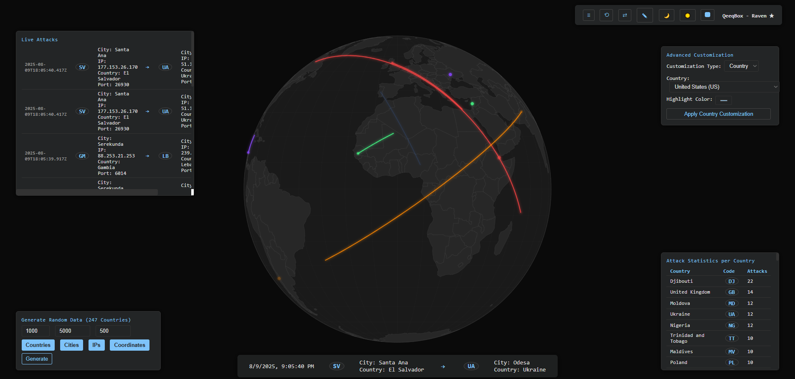

# Raven Cyber Threat Map

Raven Cyber Threat Map is a modern React web application for visualizing global cyber threat activity on an interactive map. It provides real-time attack simulation, IP lookup, and threat intelligence features.



---

## Features

- 🌍 Interactive world map visualization (D3 + TopoJSON)
- 🔎 IP geolocation & threat intelligence panel
- ⚡ Live attack simulation & random threat data
- 📊 Displays cyber threat data from JSON sources
- 📱 Responsive UI built with React

---

## Project Structure

```
public/
  ├─ assets/
  │    └─ RavenCyberThreatMap.png
  ├─ countries-110m.json
  └─ data.json
src/
  ├─ App.jsx
  ├─ App.css
  ├─ main.jsx
  └─ components/
       ├─ IPLookupPanel.jsx
       ├─ LiveAttacksPanel.jsx
       ├─ RandomDataPanel.jsx
       ├─ ThreatMap.jsx
       └─ TopControlPanel.jsx
index.html
package.json
vite.config.js
public/
  countries-110m.json
  data.json
  assets/
    intro.gif
    RavenCyberThreatMap.png
src/
  App.css
  App.jsx
  main.jsx
  components/
    IPLookupPanel.jsx
    LiveAttacksPanel.jsx
    RandomDataPanel.jsx
    ThreatMap.jsx
    TopControlPanel.jsx
```

## Getting Started

### Prerequisites

- [Node.js](https://nodejs.org/) (v16+ recommended)
- [npm](https://www.npmjs.com/) or [yarn](https://yarnpkg.com/)

### Installation

1. **Clone the repository:**

   ```sh
   git clone https://github.com/yourusername/raven-cyber-threat-map.git
   cd raven-cyber-threat-map
   ```

2. **Install dependencies:**
   ```sh
   npm install
   # or
   yarn install
   ```

### Running the App (Development)

```sh
npm run dev
# or
yarn dev
```

Open [http://localhost:5173](http://localhost:5173) in your browser.

### Building for Production

```sh
npm run build
# or
yarn build
```

### Preview Production Build

```sh
npm run preview
# or
yarn preview
```

The production build will be available in the `dist` folder.

---

## File Overview

- **public/**: Static assets & data files
- **src/App.jsx**: Main React app component
- **src/components/**: UI panels & map visualization
- **vite.config.js**: Vite build configuration

---

## Technologies Used

- [React](https://react.dev/)
- [D3.js](https://d3js.org/)
- [TopoJSON](https://github.com/topojson/topojson)
- [Vite](https://vitejs.dev/)

---

## License

MIT License

---

## Acknowledgements

- World map data from [Natural Earth](https://www.naturalearthdata.com/)

---

_Cyber Threat Map – Visualize and analyze cyber attacks in real time!_
