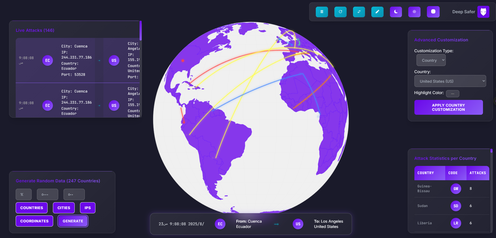

# Raven Cyber Threat Map

Raven Cyber Threat Map is a React-based web application that visualizes global cyber threat data on an interactive map.



## Features

- Interactive world map visualization using D3 and TopoJSON
- IP lookup panel for geolocation and threat intelligence
- Random data and live attack simulation panels
- Displays cyber threat data from JSON files
- Responsive UI built with React

## Project Structure

```
index.html
package.json
vite.config.js
public/
  countries-110m.json
  data.json
  assets/
    intro.gif
    RavenCyberThreatMap.png
src/
  App.css
  App.jsx
  main.jsx
  components/
    IPLookupPanel.jsx
    LiveAttacksPanel.jsx
    RandomDataPanel.jsx
    ThreatMap.jsx
    TopControlPanel.jsx
```

## Getting Started

### Prerequisites

- [Node.js](https://nodejs.org/) (v16 or higher)
- [npm](https://www.npmjs.com/) or [yarn](https://yarnpkg.com/)

### Installation

1. Clone the repository:
    ```sh
    git clone https://github.com/yourusername/cyber-threat-map.git
    cd cyber-threat-map
    ```

2. Install dependencies:
    ```sh
    npm install
    # or
    yarn install
    ```

### Running the Development Server

```sh
npm run dev
# or
yarn

Open [http://localhost:5173](http://localhost:5173) in your browser to view the app.

### Building for Production

```sh
npm run build
# or
yarn build
```

### Preview Production Build

```sh
npm run preview
# or
yarn preview
```

The production build will be in the `dist` folder.


## File Overview

- **public/**: Static assets and data files
- **src/App.jsx**: Main application component
- **src/components/**: React components for panels and map visualization
- **vite.config.js**: Vite configuration


## Technologies Used

- [React](https://react.dev/)
- [D3.js](https://d3js.org/)
- [TopoJSON](https://github.com/topojson/topojson)
- [Vite](https://vitejs.dev/)

## License

This project is licensed under the MIT License.

## Acknowledgements

- World map data from [Natural Earth](https://www.naturalearthdata.com/)

*Cyber Threat Map - Visualize and analyze cyber attacks in real time!*
